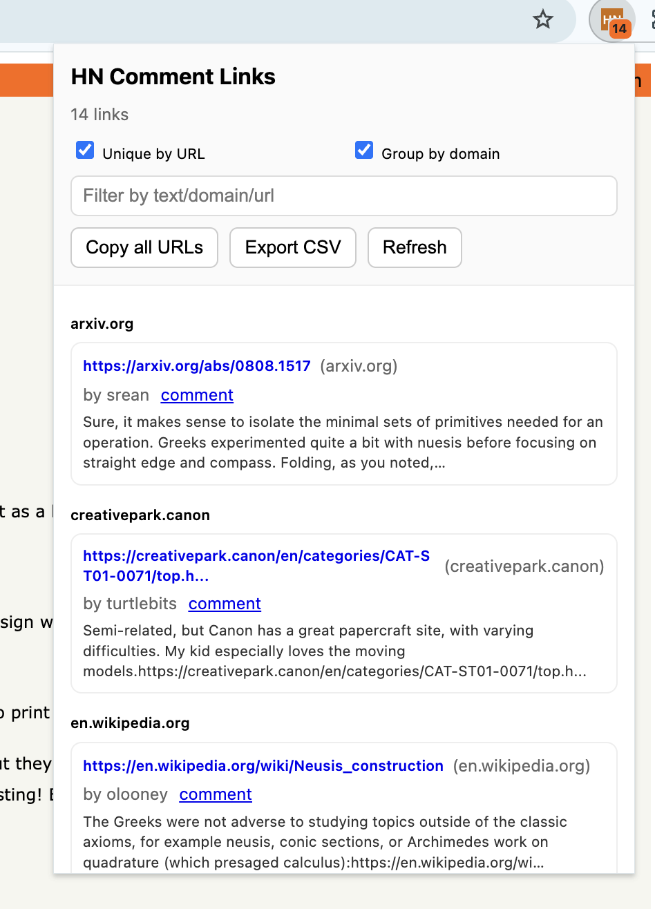

# HN Comment Links

HN Comment Links is a Chrome extension that extracts every hyperlink found in the comment section of a Hacker News discussion page and makes them easy to browse.  When you open the popup, it lists the links, allows you to filter or group them by domain, and provides one‑click actions to copy all URLs or export them as a CSV.  The toolbar icon displays a badge showing the number of unique links and changes colour when you're on an eligible Hacker News page.

## What it does and why it's useful

When you open a discussion on Hacker News, links posted by commenters are scattered throughout the thread.  HN Comment Links automatically scans the `.commtext` elements on `news.ycombinator.com/item` pages, collects the anchors, and presents them in one list.  This saves you from scrolling through every comment to find interesting resources.

## Features

* **Popup UI** – Displays all hyperlinks found in comment bodies.  Each entry shows the URL, domain, author (when available), a short snippet of the comment text, and a direct permalink to the comment.
* **Badge count & coloured icon** – The extension icon is grey on most sites and turns orange on Hacker News item pages.  A badge indicates the number of unique links found on the current page.
* **Grouping and filtering** – Toggle deduplication to hide duplicate URLs, group links by domain, and search within the list to quickly find specific entries.
* **Copy & export** – Copy all links to the clipboard or download them as a CSV file.

## Installation

### From the Chrome Web Store

Once the extension is published, install it directly from the Chrome Web Store (link coming soon).

### Manual install

1. Download or clone this repository.
2. Open `chrome://extensions` in Google Chrome.
3. Enable **Developer mode** using the toggle in the top‑right corner.
4. Click **Load unpacked** and select the `hn-comment-links` folder in this repository.
5. Navigate to any Hacker News discussion (for example `https://news.ycombinator.com/item?id=38616185`) and click the extension icon.

## Usage

1. Visit a Hacker News item page (stories, `Ask HN`, or `Show HN` posts).
2. Click the **HN Comment Links** icon in your Chrome toolbar.  The popup lists all hyperlinks extracted from comment bodies.
3. Use the search bar to filter results, enable the **Unique** toggle to remove duplicates, or enable **Group by domain** to group links by their host.
4. Click **Copy all** to copy all displayed URLs to your clipboard or **Export CSV** to download the list as a CSV file.

The badge on the extension icon shows how many unique links were found.  When you switch tabs or navigate away from Hacker News, the badge and icon reset.

## Permissions

HN Comment Links requests only the minimal set of permissions needed to perform its task.  The Chrome Web Store guidelines recommend requesting the least number of permissions consistent with the purpose of the extension:contentReference[oaicite:0]{index=0}.  The permissions used are:

| Permission | Purpose |
|-----------|---------|
| `activeTab` | Allows the extension to read and parse the content of the currently active tab so it can extract comment links. |
| `tabs` | Enables updating the badge count and icon when you switch between tabs. |
| `clipboardWrite` | Lets you copy all links to the clipboard when you click **Copy all**. |
| Host permission `https://news.ycombinator.com/*` | Restricts the content script to run only on Hacker News item pages. |

## Development

This extension is built using plain JavaScript and Manifest V3.  To work on it locally:

1. Edit the source files in the `hn-comment-links` directory.
2. Increment the `version` field in `manifest.json` with each release.
3. Reload the unpacked extension via `chrome://extensions` → **Reload**.
4. Test your changes on a Hacker News discussion page.

Feel free to submit pull requests or open issues if you have suggestions or find bugs.  Contributions are welcome!

## Privacy

HN Comment Links does **not** collect, store or transmit any personal data.  All processing is performed locally on the page that you are viewing.  For more details, see our [Privacy Policy](privacy-policy.md).  Our policy is based on the principle that extensions should disclose how they collect and use data and should only request necessary permissions:contentReference[oaicite:1]{index=1}:contentReference[oaicite:2]{index=2}.

## License

This project is licensed under the MIT License.  See [LICENSE](LICENSE) for details.
